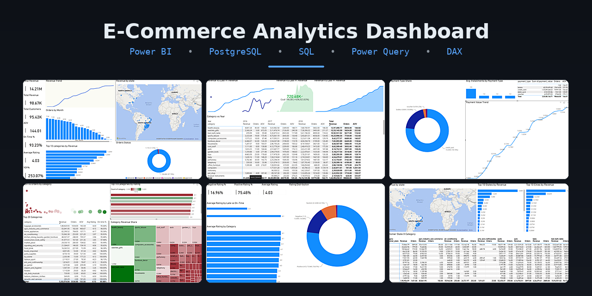
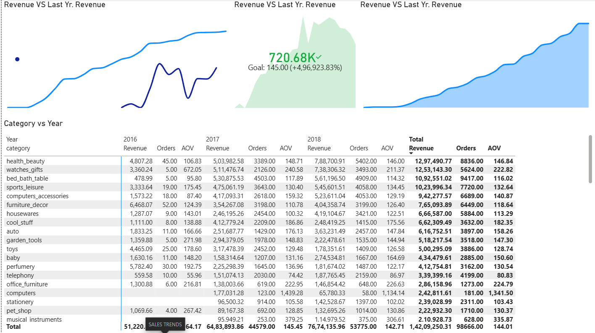
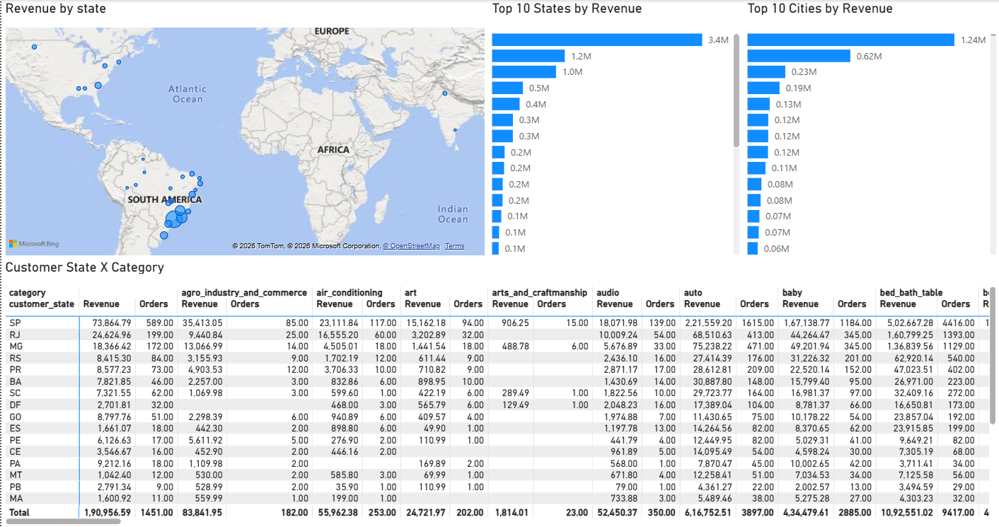

# 📊 E-Commerce Analytics Dashboard



An end-to-end **Business Intelligence** project built using **Power BI**, **PostgreSQL**, **SQL**, **Power Query**, and **DAX** to analyze the Brazilian E-Commerce (Olist) dataset and transform raw transactional data into interactive business insights.


---

# 📌 Project Overview

This project demonstrates a complete **Data Analytics workflow**—from designing a relational database in PostgreSQL to building an interactive Power BI dashboard for business decision-making.

Using the **Brazilian E-Commerce Public Dataset by Olist**, the dashboard provides insights into:

- 📈 Sales Performance
- 👥 Customer Behavior
- 🌍 Geographic Distribution
- 🚚 Delivery & Logistics
- 🏪 Seller Performance
- ⭐ Customer Reviews
- 💳 Payment Analysis
- 📦 Product Category Performance

The objective of this project was to gain hands-on experience with the complete Business Intelligence pipeline while creating a portfolio-ready analytics solution.

---

# 🌟 Project Highlights

- End-to-end Business Intelligence workflow
- PostgreSQL database design and implementation
- SQL-based data import and transformation
- SQL Views for reporting
- Database optimization using Indexes
- Relational database with Foreign Keys
- Interactive Power BI Dashboard
- DAX Measures for business KPIs
- Drillthrough reports
- Geographic visualization
- Interactive slicers and filters

---

# 📷 Dashboard Preview

## Executive Dashboard


## Sales Trends



## Customer Geography



---

# 🎯 Business Objectives

The dashboard was built to answer business questions such as:

- How are sales performing over time?
- Which product categories contribute the most revenue?
- Where are customers located?
- How efficient are deliveries?
- What payment methods are most commonly used?
- How satisfied are customers?
- Which sellers contribute the most?
- What trends can help support business decisions?

---

# 📄 Dashboard Pages

- 📌 Executive Dashboard
- 📈 Sales Trends
- 📦 Category & Product Analysis
- 🌍 Customer Geography
- 🚚 Delivery & Logistics
- ⭐ Customer Reviews
- 💳 Payments Analysis
- 🏪 Seller Performance
- 🔍 Drillthrough Analysis

---

# 📈 Key Business Insights

The dashboard enables stakeholders to:

### 📊 Sales Performance
- Track revenue and order trends over time.
- Compare business performance across different periods.
- Monitor key business KPIs.

### 📦 Product Analysis
- Identify top-performing product categories.
- Analyze category-wise revenue.
- Compare product performance.

### 🌍 Customer Analysis
- Visualize customer distribution geographically.
- Identify customer concentration across regions.
- Analyze purchasing trends.

### 🚚 Logistics Analysis
- Evaluate delivery performance.
- Monitor shipping timelines.
- Identify potential logistics bottlenecks.

### ⭐ Customer Reviews
- Analyze customer satisfaction.
- Monitor average ratings.
- Understand review distribution.

### 💳 Payment Analysis
- Compare payment methods.
- Understand payment behavior.

### 🏪 Seller Performance
- Evaluate seller contribution.
- Compare seller performance.
- Analyze marketplace activity.

---

# 🛠️ Tech Stack

| Technology | Purpose |
|------------|---------|
| Power BI | Dashboard Development |
| PostgreSQL | Database |
| SQL | Database Design & Transformation |
| Power Query | Data Cleaning |
| DAX | Business Calculations |
| Git & GitHub | Version Control |
| Kaggle Olist Dataset | Data Source |

---

# 🔄 Analytics Pipeline

```text
Olist Dataset (CSV)
        │
        ▼
 PostgreSQL Database
        │
 ├── Create Tables
 ├── Import CSV Data
 ├── Foreign Keys
 ├── Indexes
 └── SQL Views
        │
        ▼
 Power BI Desktop
        │
 ├── Power Query
 ├── Data Modeling
 ├── DAX Measures
 └── Interactive Dashboard
        │
        ▼
 Business Insights
```

---

# 📂 Repository Structure

```text
powerbi-ecommerce-analytics-dashboard
│
├── Ecommerce Analytics Dashboard.pbix
├── README.md
│
├── SQL
│   ├── CreateTables.sql
│   ├── CopyCSV.sql
│   ├── ForeignKey.sql
│   ├── Index.sql
│   └── BIViews.sql
│
├── DAX
│   └── DAX Measures.md
│
├── Dataset
│   └── dataset_link.md
│
└── Screenshots
    ├── github-banner.png
    ├── Executive_Dashboard.png
    ├── Sales_Trends.png
    ├── Category_Product.png
    ├── Customer_Geography.png
    ├── Delivery_Logistics.png
    ├── Reviews.png
    ├── Payments.png
    ├── Sellers.png
    └── Drillthrough.png
```

---

# ✨ Dashboard Features

- Executive KPI Dashboard
- Interactive Filters & Slicers
- Drillthrough Reports
- Geographic Maps
- Product Category Analysis
- Customer Review Analysis
- Seller Performance Analysis
- Delivery Performance Dashboard
- Payment Analysis
- Revenue Trend Analysis

---

# 💼 Skills Demonstrated

### SQL
- DDL
- DML
- Views
- Foreign Keys
- Indexing

### PostgreSQL
- Database Design
- Relational Database Modeling
- Query Optimization

### Power BI
- Power Query
- Data Modeling
- DAX
- Drillthrough
- Interactive Dashboards

### Business Intelligence
- KPI Development
- Dashboard Design
- Data Visualization
- Business Analytics

---

# 📖 What I Learned

Through this project, I gained practical experience in:

- Designing relational databases in PostgreSQL
- Importing raw CSV datasets into PostgreSQL
- Writing SQL scripts for database creation
- Creating SQL Views for reporting
- Optimizing queries using Indexes
- Establishing relationships using Foreign Keys
- Cleaning and transforming data with Power Query
- Building business KPIs using DAX
- Developing interactive dashboards in Power BI
- Understanding the end-to-end Business Intelligence workflow

---

# 📊 Dataset

This project uses the **Brazilian E-Commerce Public Dataset by Olist**.

Dataset Link:

https://www.kaggle.com/datasets/olistbr/brazilian-ecommerce

---

# 🚀 Getting Started

## 1. Download the Dataset

Download the dataset from Kaggle.

## 2. Create PostgreSQL Database

```sql
CREATE DATABASE olist_db;
```

## 3. Execute SQL Scripts

Run the SQL files in the following order:

1. CreateTables.sql
2. CopyCSV.sql
3. ForeignKey.sql
4. Index.sql
5. BIViews.sql

## 4. Open Power BI

Open:

```
Ecommerce Analytics Dashboard.pbix
```

Update the PostgreSQL connection if required.

Server:

```
localhost
```

Database:

```
olist_db
```

Refresh the report.

---

# 🌱 About This Project

This is my **first end-to-end Data Analytics project**.

Rather than focusing solely on creating a visually polished dashboard, my goal was to understand the complete analytics workflow—from database design and SQL to data transformation, data modeling, DAX, and dashboard development.

This project helped me build a strong foundation in Business Intelligence and strengthened my understanding of how raw data can be transformed into meaningful insights for decision-making.

It represents the beginning of my journey in Data Analytics, and I look forward to applying these skills in more advanced projects.

---

# 🚀 Future Improvements

As I continue learning, I plan to enhance future versions of this project by incorporating:

- 📈 Sales Forecasting
- 👥 Customer Segmentation
- 🎯 RFM Analysis
- 📦 Inventory Analytics
- 💰 Profitability Analysis
- 📊 Advanced DAX Techniques
- 🎨 Improved Dashboard UI/UX
- 📖 Better Data Storytelling
- 🤖 Predictive Analytics

---

# 🤝 Feedback

I'm continuously learning and improving my skills in Data Analytics.

Suggestions, feedback, and constructive criticism are always welcome.

If you have ideas for improving this project, feel free to open an issue or connect with me on LinkedIn.

---

# 👨‍💻 Author

## **Shovan Kumar Sasmal**

- GitHub: https://github.com/Shovan05
- LinkedIn: https://www.linkedin.com/in/shovan-kumar-sasmal-635410220

---

⭐ **If you found this project interesting or helpful, consider giving it a star!**
